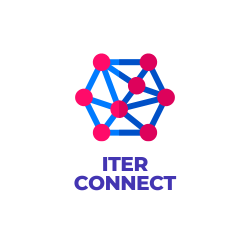

# CONNECT

## Problem statement
One of the most common problem faced by people in genral is to find a group of people that share the same vision and can work together. Students, Mentors, Seniors, freshers , Developers, Professors, etc all can help eachother to build something better. But its hard to form a group and even harder to manage.
## Proposed Solution with Screenshots

          

          

  

download apk : https://drive.google.com/file/d/12YNkkzEVfg36DNPLQzuTbLxZTOyYmFKs/view?usp=sharing

youtube link for working screen record : https://youtu.be/ccSi45J5MfY

